# Admin Gateway

## Equipment / Ammunition
### Create
Подается 1000 rps в течение 50 секунд
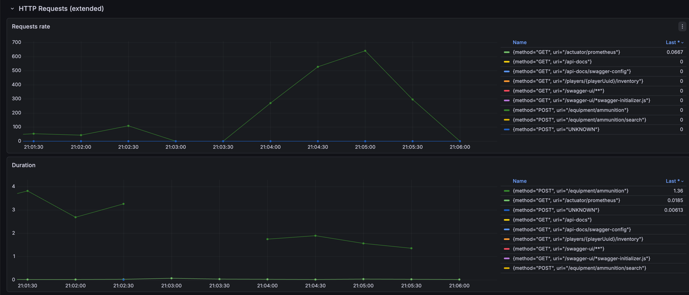

## Equipment / Attachment
### Create
Подается 1000 rps в течение 25 секунд для создания демпферов.
Параллельно подается 1000 rps в течение 25 секунд для создания глушителей.
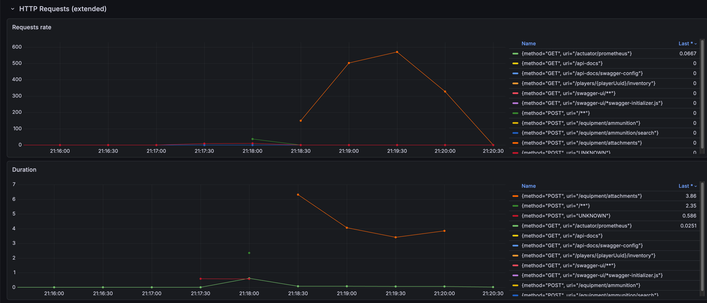

## Equipment / Grenade
### Create
Подается 500 rps в течение 100 секунд
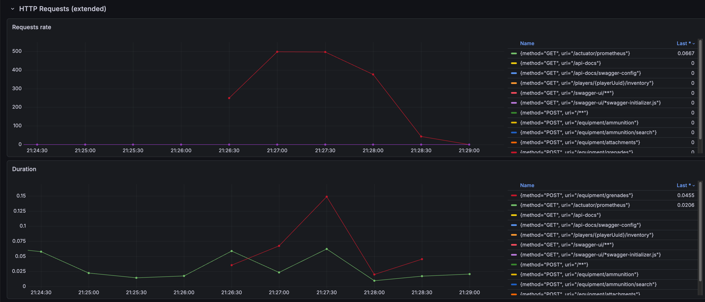

## Equipment / Currency
### Create
Подается 750 rps в течение 70 секунд
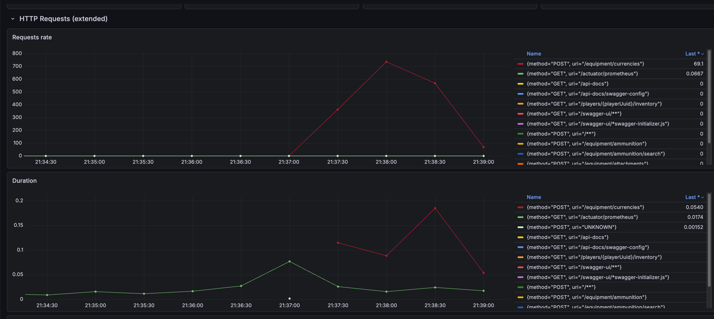
После создания валют произошла сборка мусора
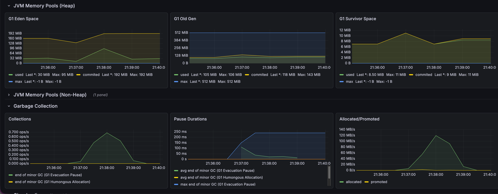

## Equipment / Gun
### Create
Подается 400 rps в течение 60 секунд для создания пистолетов.
Параллельно подается 700 rps в течение 35 секунд для создания автоматов. 
Затем выполняется сборка мусора
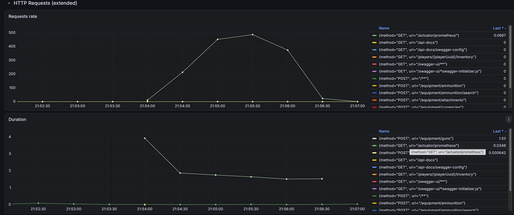
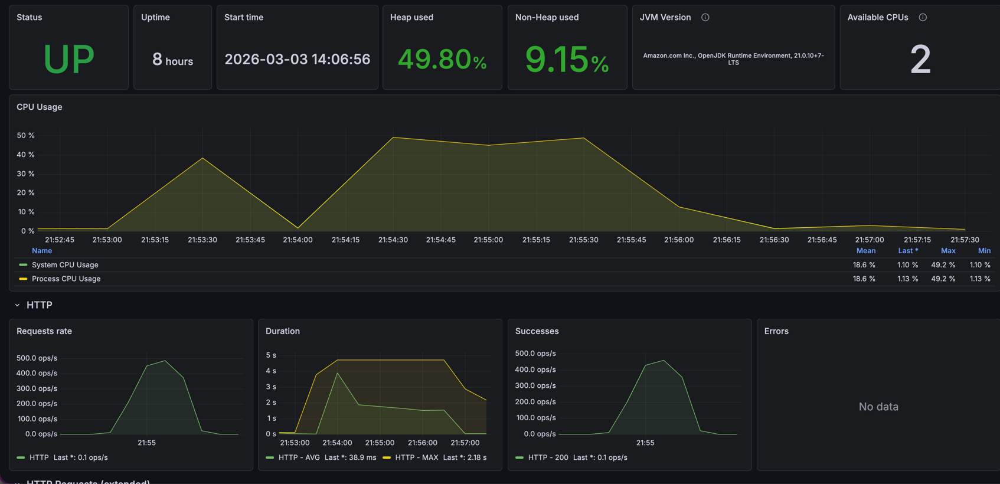
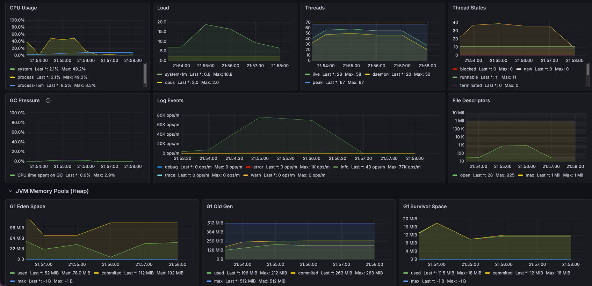

## Players
### Search
Подается 400 rps в течение 90 секунд. Происходит чтение случайной страницы справочника. Страница 100 записей.
[//]: # (TODO!!!)

## Market / Money bundle
### Create
Подается 500 rps в течение 100 секунд
[//]: # (TODO!!!)

## Market / Account
### Give currency
Подается 500 rps в течение 100 секунд
[//]: # (TODO!!!)

## Inventory
### Give equipment
Подается 500 rps в течение 100 секунд
[//]: # (TODO!!!)

# Player Gateway

## Equipment / Ammunition
### Search
Подается 1000 rps в течение 50 секунд. Происходит чтение случайной страницы справочника. Страница 100 записей.
Затем выполняется сборка мусора
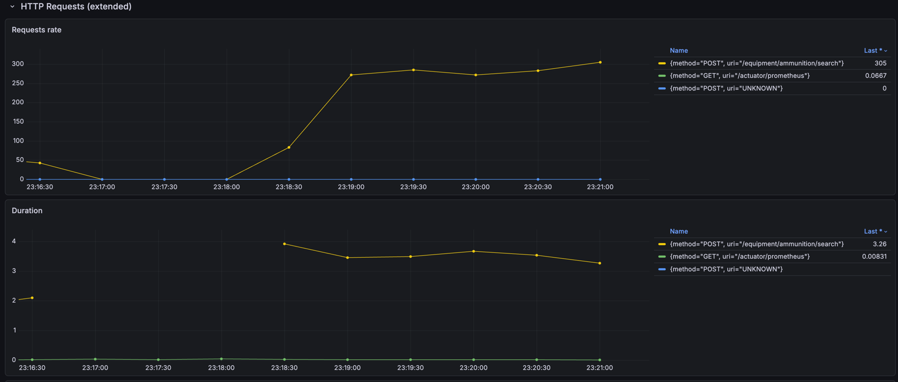
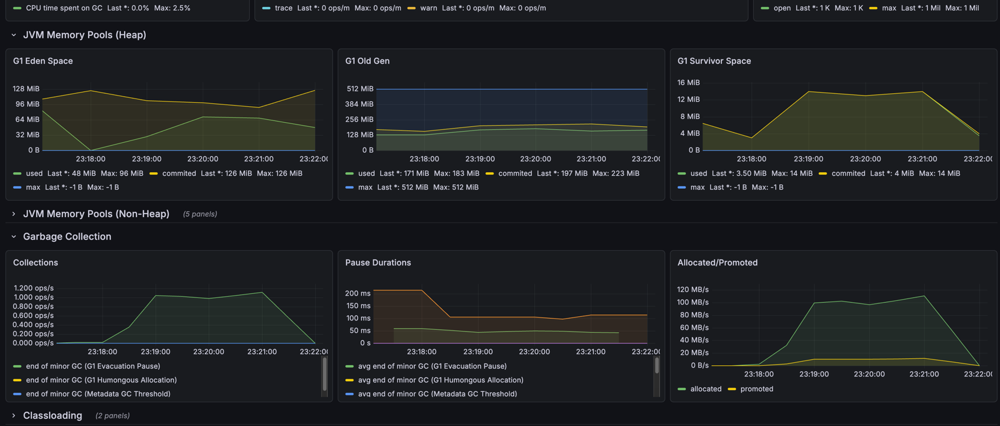

## Equipment / Attachment
### Search
Подается 500 rps в течение 60 секунд. Происходит чтение случайной страницы справочника. Страница 100 записей.
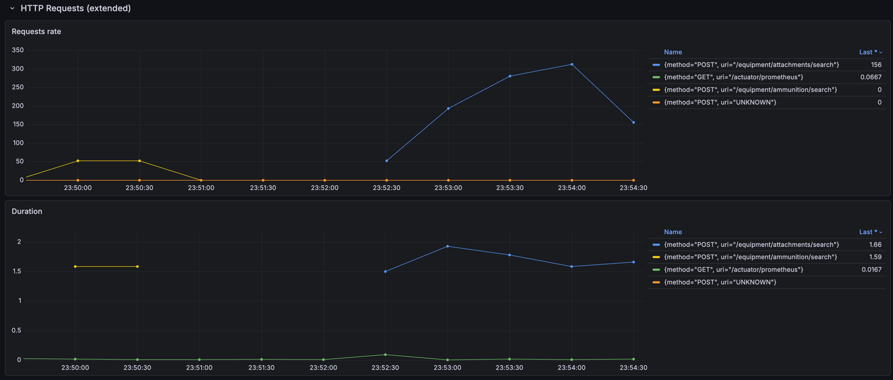

## Equipment / Gun
### Search
Подается 300 rps в течение 90 секунд. Происходит чтение случайной страницы справочника. Страница 100 записей.
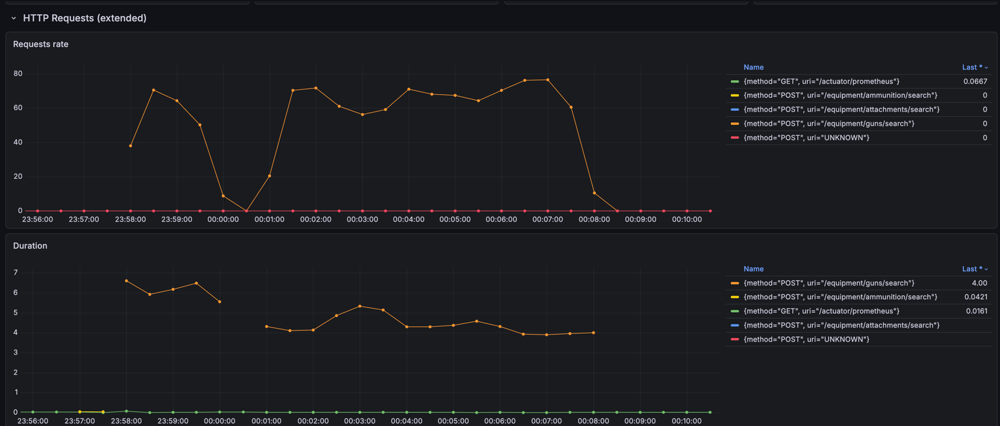

## Equipment / Grenade
### Search
Подается 400 rps в течение 90 секунд. Происходит чтение случайной страницы справочника. Страница 100 записей.
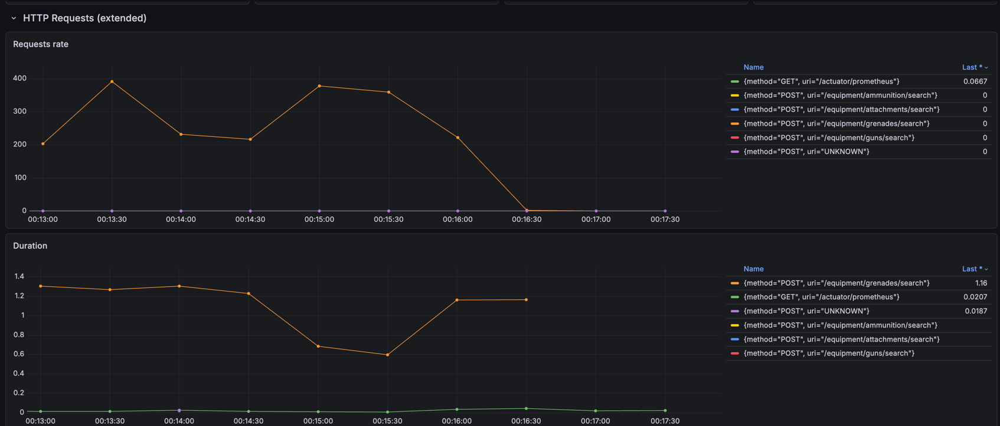

## Equipment / Currency
### Search
Подается 350 rps в течение 90 секунд. Происходит чтение случайной страницы справочника. Страница 100 записей.
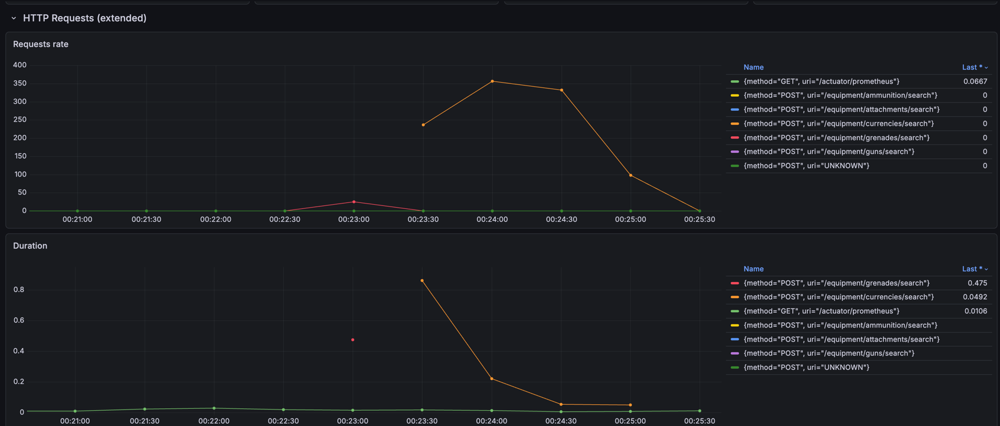

## Market / Account
### Read
Подается 400 rps в течение 90 секунд. Происходит чтение случайной страницы справочника. Страница 100 записей.
[//]: # (TODO!!!)

## Market / Account log
### Read
Подается 400 rps в течение 90 секунд. Происходит чтение случайной страницы справочника. Страница 100 записей.
[//]: # (TODO!!!)

## Market / Inventory
### Read
Подается 400 rps в течение 90 секунд. Происходит чтение случайной страницы справочника. Страница 100 записей.
[//]: # (TODO!!!)

## Market / Inventory log
### Read
Подается 400 rps в течение 90 секунд. Происходит чтение случайной страницы справочника. Страница 100 записей.
[//]: # (TODO!!!)