# Admin Gateway

## Equipment / Ammunition
### Create
Подается 1000 rps в течение 50 секунд

## Equipment / Attachment
### Create
Подается 1000 rps в течение 25 секунд для создания демпферов.
Параллельно подается 1000 rps в течение 25 секунд для создания глушителей.

## Equipment / Grenade
### Create
Подается 500 rps в течение 100 секунд

## Equipment / Currency
### Create
Подается 750 rps в течение 70 секунд

После создания валют произошла сборка мусора

## Equipment / Gun
### Create
Подается 400 rps в течение 60 секунд для создания пистолетов.
Параллельно подается 700 rps в течение 35 секунд для создания автоматов. 
Затем выполняется сборка мусора

## Players 
### Search
Подается 200 rps в течение 90 секунд. Происходит чтение случайной страницы справочника. Страница 100 записей.
Тест выполняется с меньшей нагрузкой на машину, в особенности на жесткий диск.
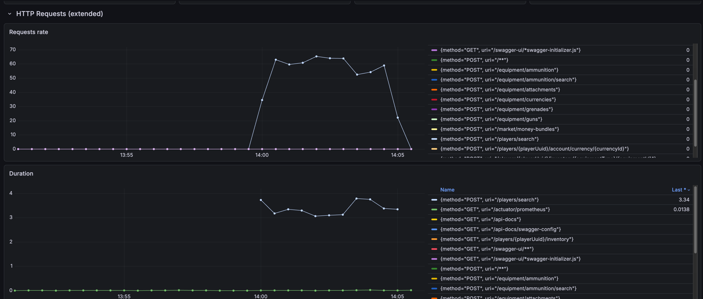
[//]: # (TODO анализировать низкую производительность)

## Market / Money bundle
### Create
Подается 400 rps в течение 130 секунд
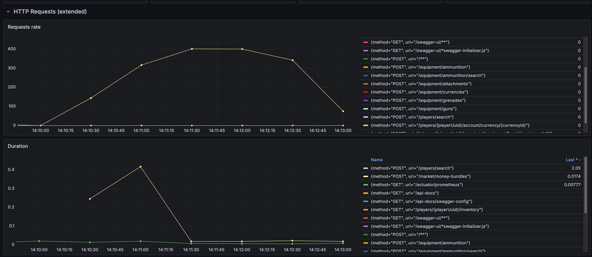

## Market / Account
### Give currency
Подается 500 rps в течение 200 секунд
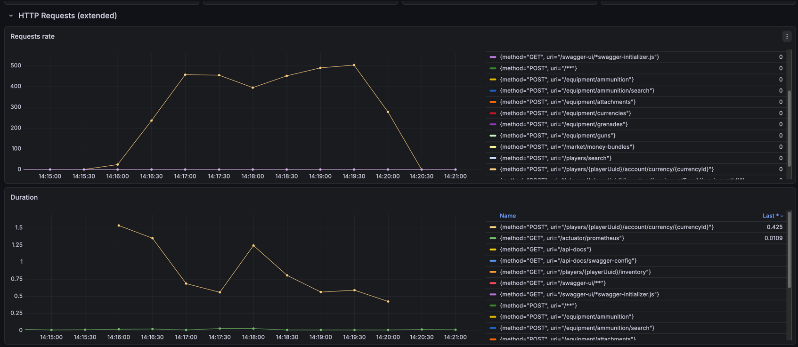

## Inventory
### Give equipment
Подается 500 rps в течение 300 секунд
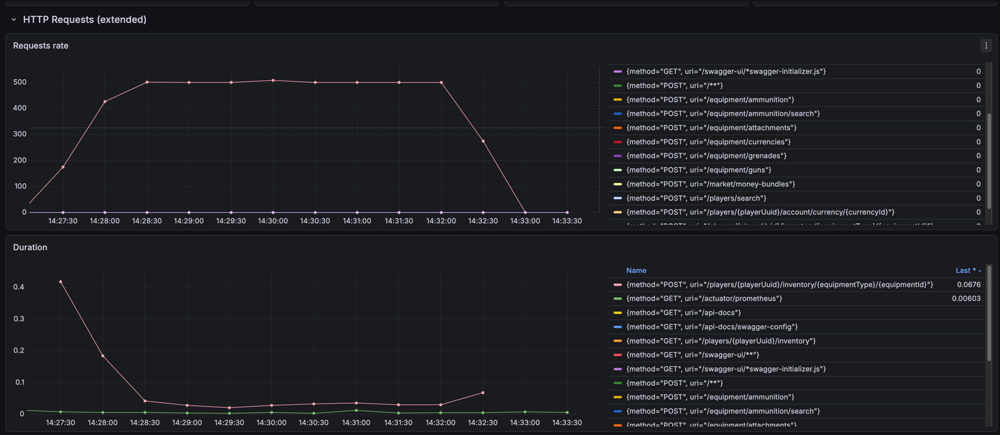

# Player Gateway

## Equipment / Ammunition
### Search
Подается 1000 rps в течение 50 секунд. Происходит чтение случайной страницы справочника. Страница 100 записей.
Затем выполняется сборка мусора

## Equipment / Attachment
### Search
Подается 500 rps в течение 60 секунд. Происходит чтение случайной страницы справочника. Страница 100 записей.

## Equipment / Gun
### Search
Подается 300 rps в течение 90 секунд. Происходит чтение случайной страницы справочника. Страница 100 записей.

## Equipment / Grenade
### Search
Подается 400 rps в течение 90 секунд. Происходит чтение случайной страницы справочника. Страница 100 записей.

## Equipment / Currency
### Search
Подается 350 rps в течение 90 секунд. Происходит чтение случайной страницы справочника. Страница 100 записей.

## Market / Product trade
### Create
Подается 70 rps в течение 300 секунд. Большее количество параллельных покупок приводит к исключениям с оптимистичной блокировкой в БД.
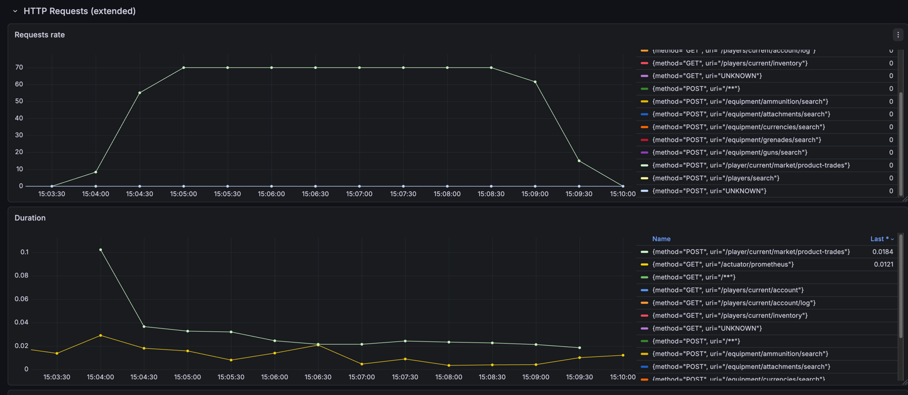
Ошибки:
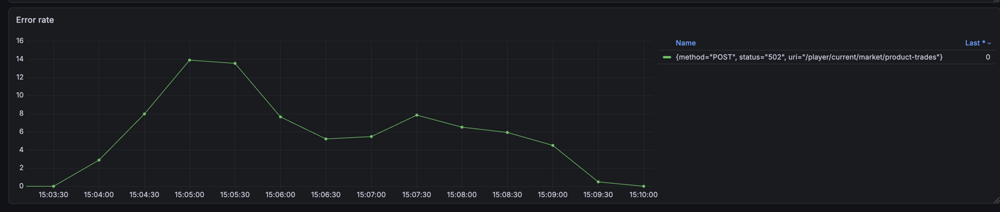
Сборка мусора:
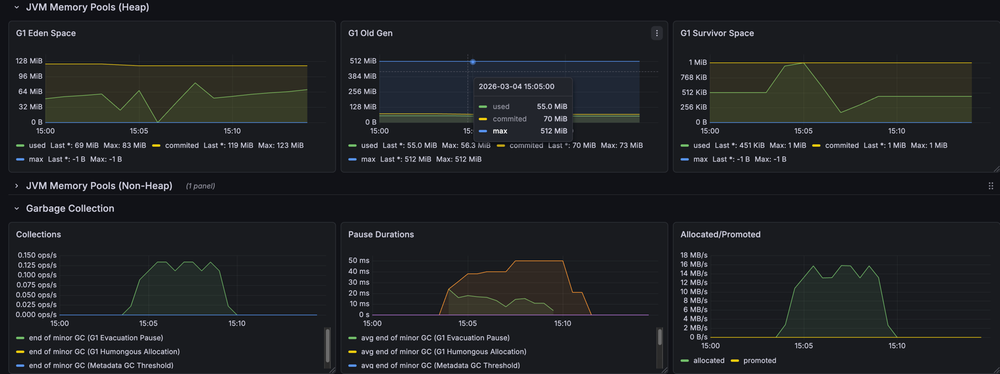
[//]: # (TODO исследовать эту проблему)

## Market / Account
### Read
Подается 400 rps в течение 90 секунд. Происходит чтение страницы. Страница 100 записей.

## Inventory / Inventory
### Read
Подается 350 rps в течение 120 секунд. Происходит чтение страницы. Страница 100 записей.
Процессор загружен на 50%
[//]: # (TODO подумать насчет одновременными запросами к справочнику, если в кеше нет нужного значения)
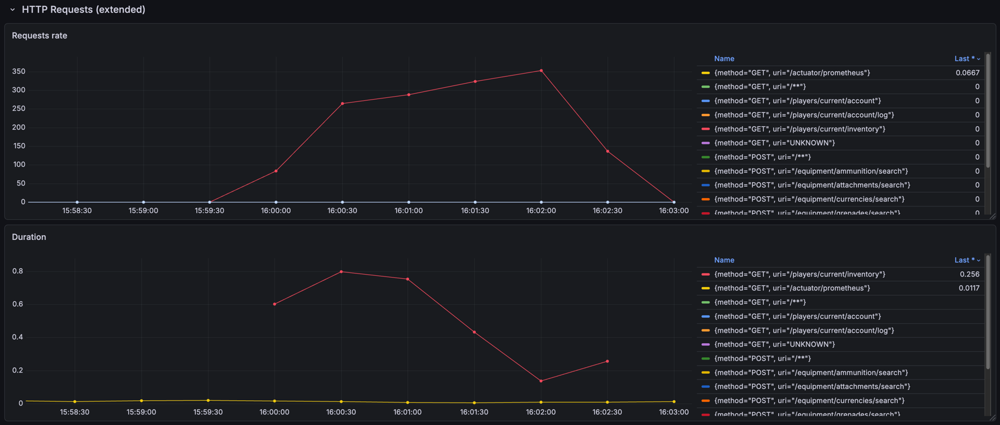

# Тесты Player Gateway с выключенным кэшированием данных справочника
## Inventory / Inventory
### Read
Подается 350 rps в течение 120 секунд. Происходит чтение страницы. Страница 100 записей.
Максимальная загрузка процессора 55%. Активная сборка мусора.
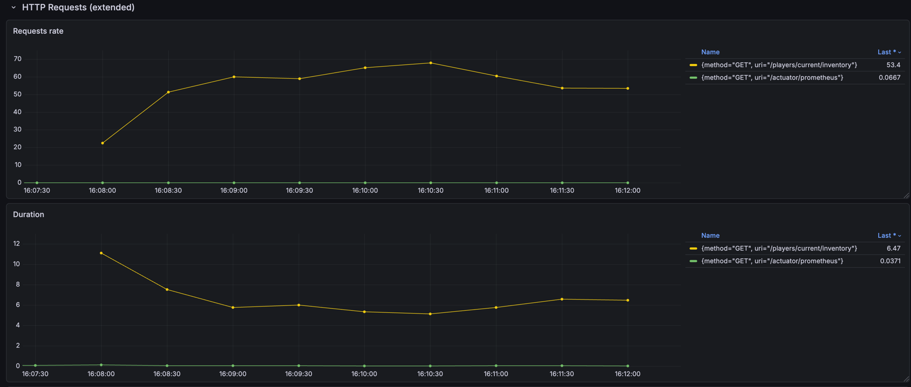
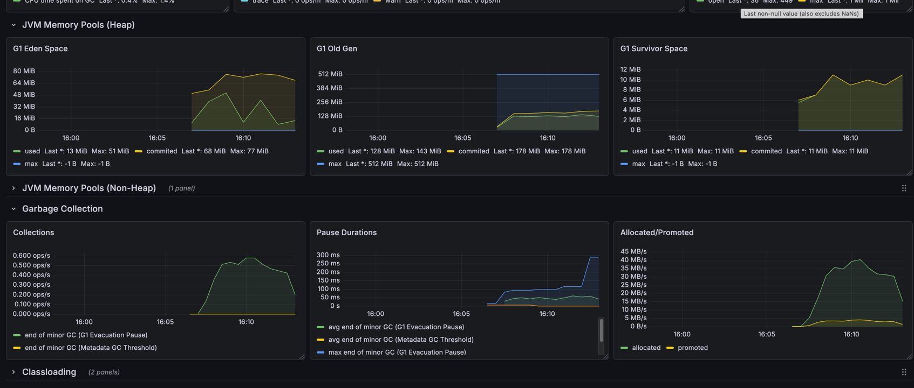

# Тест с низким RPS в rate limiter
В rate limiter установлено ограничение 10 RPS, подается 15 RPS в течение 120 секунд.
## Inventory / Inventory
### Read
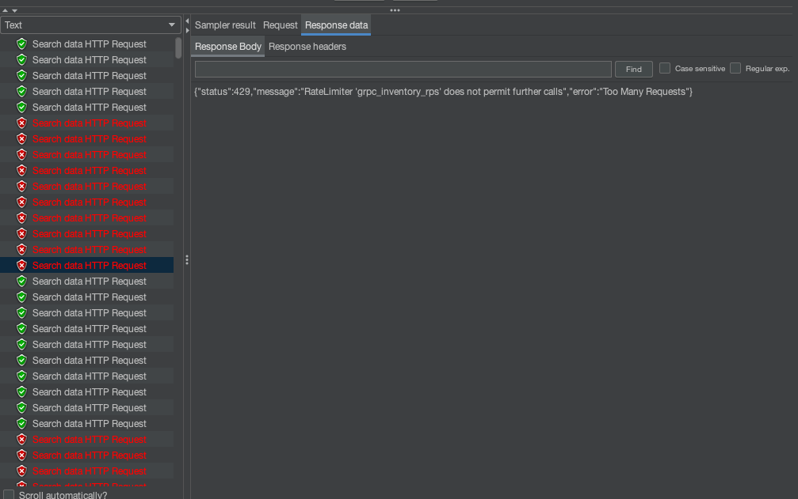